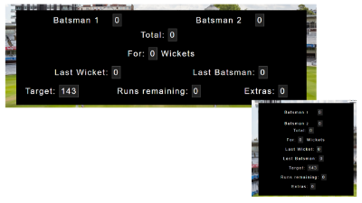
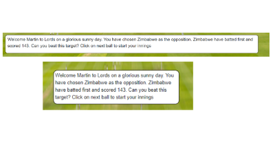
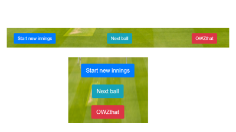
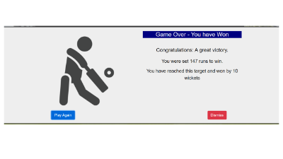
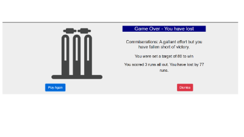
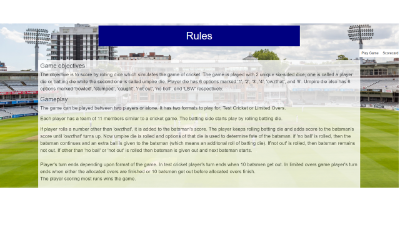
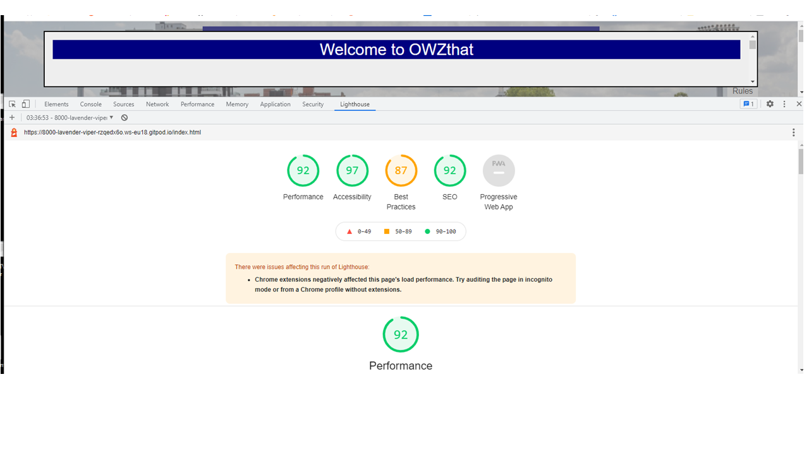

# OWZthat
## Portfolio-project-2-Javascript-Essentials

### overview
Owzthat was a game I played when I was a child in the 1970's. It was based on the game of cricket and involved the rolling of two six sided dice. I thought it would be great if this game could be reproduced as an online version so users could experience the entertainment I had as a child with a few extra features. The user or player plays against the computer, which generates a target score based on one of four levels chosen by input from the player. The player has to beat the target set by the computer. 

image of Original OWZthat game

Owzthat demonstrates Javascript in its use of arrays, event listeners random number generators, conditional statements, manipulation of the DOM and functions to replicate the gameplay.

With the online game not being limited to the outcomes of two six sided dice, I have taken the opportunity to modify some of the scoring and wicket loss frequencies. This has been to more accurately reflect outcomes I consider can realistically be expected from a real game of cricket.

### responsiveness screenshot

Screenshot of Owzthat displayed on Am I Responsive website.

### features

### existing features

#### Opening game start dialogue box
Upon opening Owzthat a game start dialogue box is immediately displayed to the player. The gameplay area is displayed greyed out in the background. This is so the player can enter their name and choose an opponent and difficulty level. 

Starting options dialogue box screenshot

On submitting the dialogue box form, it is validated to ensure the player has entered a name and selected a team to play against. If there is data missing a further dialogue box is displayed to the player informing them the fields must be completed before continuing.

Once the form passes validation and is submitted by the player, a target score is generated and the main game play screen is revealed.

#### game play page and rules page

There are two pages of the Owzhat website. The first page is the main gameplay area and the second page sets out the rules and procedures of the game to the player.

#### heading

The headings of the gameplay and rules page are displayed using as close to the styling and colours of the original OWZthat game tin as possible. This is to maintain the association with the original game.

OWZthat website title bar

#### navigation bar

there is a navigation bar with one item which allows the player to navigate to and from the rules page and main gameplay page.

Navigation bar screenshot

#### scoreboard
The scoreboard is the area that displays all the game data to the player. It includes the target reqired which is static throughout the game. Batsman scores, total scores and extras are incremented as runs and extras are scored. One of the current batsmen, the wickets, last wicket and last batsman scores are updated as a wicket falls. The runs remaining score is decremented as runs and extras are scored.

Scoreboard screenshot

If in the game the wickets total reaches 10 the game is lost. Otherwise if the total equals the target (and runs remaining reaches 0) the game is won.

Through the scoreboard the player is able to monitor progress against the target throughout the game.

#### dialogue/commentary area
The commentary dialogue area, on initial start up, welcomes the player to the game and displays the target for the player to try and beat. Throught the progression of the game the commentary dialogue box provides ball by ball commentary to the player of the outcome of each batsman shot and umpire decision.

Commentary/Dialogue Box Screenshot

Through the commentary dialogue box the player is informed whether to next click the play ball or OWZthat button.

#### buttons
There are three buttons in the main game area.

Gameplay buttons screenshot

The "Start new innings" allows the player to abort the current game and start a new innings. When this button is clicked a dialogue box will appear asking the player to confirm this action.
The "Next Ball" button is clicked to play the next ball. Clicking this button instigates a commentary and finally the outcome of the shot. This may be that runs are or are not scored ot that there is an appeal by the fielding side.
In the case of an appeal by the fielding side, the player is informed to click the "Owzthat" button. The result of the "Owzthat" button may be that the batsman is out, extras have been scored ot the batsman is not out. the result is displayed to the player in the commentary dialogue box. If a wicket has fallen the method of being out - caught, bowled, LBW etc is displayed to the player. In this instance the scoreboard is updated accordingly. If there are extras, the commentary dialogue area displays the type of extra to the player and the runs are incremented on the scoreboard. In the case of the player being not out or extras being scored the player is informed to continue playing by clicking the "Next ball" button.

While in normal gameplay - i.e. until such time as the "Next ball" outcome is OWZthat - the "OWZthat" button is disabled and greyed out. This prevents the player from instigating the fall of a wicket when there has not been an appeal. Similarly from the time of an "OWZthat" outcome and pending the decision of the appeal the "Next ball" button is disabled. This prevents the player from continuing with a next ball when a OWZthat outcome has occured.

#### End of game win dialogue box

Win dialogue box screenshot

If the computer set score is achieved by the player a congratulations dialogue box opens. This reports the set score and the margin of the win. The player is invited to play again or dismiss the dialogue by selecting one of two buttons.

#### End of game lose dialogue box

Lose dialogue box screenshot

If the player loses all their wickets before reaching the computer set score, a dialogue box commiserating the player is displayed. The box includes the original target and the losing margin. The player is invited to play again or dismiss the dialogue box by selecting one of two buttons.

#### rules

Rules page screenshot

The Rules page displays the rule and procedures of the game to the player and are available through a navigation link from the game play page throughout the course of the game. There is also a navigation link on the riule page to return to the gameplay page.

### features left to implement
One of the attractions for me when deciding to embark on this project was the potential for further features that might be implemented. I am hoping it will be possible to return to at least the concept of this project in a future course module and implement many of the enhancements and further features. If not it certainly will be my intention to further develop the game in my own time. Much of the potential for further features to implement would be unlocked through the linking of the game to a back-end database. A list of potential future enhancements include (not an exhaustive list);
- Option for player v player play;
- linkages to databases;
- including player names and data;  
- Weighting batsmen by position in batting order (or official statistics) using custom dice arrays;
- Weighting scoring and wicket outcomes according to input high score/risk choice by player
- Playing a limited balls/overs game
- Weighting teams scores according to relative standings in cricket rankings
- Maintaining player highest score rankings (through linkages to database). 

### Testing
I have ran a number of games on a pre-deployment version of the site and the game appears to run without any apparent bugs. There are no alerts reported in the console.
I have viewed the site on Desktop, laptop, tablet and smartphone devices and the site appears responsive across all media.

#### browsers
I have tested OWZthat on Google Chrome, Opera, Microsoft Edge and Firefox. It appears and works as expected on all above browsers except Firefox. On Firebox the gane start dialogue box does not appear and the toggle function to switch batsman at the score of an odd number of runs does not work.

#### HTML
The Owzthat site has been passed through W3C HTML validator. No errors were reported. There were 9 warnings all related to headers which are not applicable to this site.

### CSS
The OWZthat site has been passed through the W3C CSS Validation Service (Jigsaw). No error were found.

### Javascript
Ther OWZthat site was passed through JSHint. No errors were reported. The following metrics were reported
There are 23 functions in this file.
Function with the largest signature take 2 arguments, while the median is 0.
Largest function has 22 statements in it, while the median is 6.
The most complex function has a cyclomatic complexity value of 13 while the median is 1

### Lighthouse
The Owzthat website was passed through Lighthouse on Google Chrome and the following results were reported:
- Performance: 92%
- Accessibility 97%
- Best Practices 87%
- SEO 92%

Lighthouse report screenshot

The lower scores on performance and Best practice appear to be largely related to the use of .png formats rather than emerging AVIF or WebP formats. I chose to retain .png formats in line with the course lecture content and examples.

### unfixed bugs

There are no known unresolved bugs but there is an issue with cross browser compatability with Firefox. As I understand it the portfolio assessment does not specify cross browser compatability as a pass criteria. Not has cross browser compatability been covered to date on the course.

### Deployment
the Owzthat website has been deployed to GitHub pages
The steps taken to deploy the site were as follows:
- From the GitHub repository select "Settings"
- From the Settings Options menu select pages
- In the "Pages" page from the source section select "main" as the brach and click "Save"

The live link can be found at: https://marbri-18.github.io/Portfolio-project-2-Javascript-Essentials/

### Credits
- CSS styling has used Bootstrap classes. Buttons have all been styled using Bootstrap. The Dialog Box and in particular the Scoreboard layout relies on Bootstrap. (https://getbootstrap.com/)
- End game win and lose icons were dowloaded as a set from ShutterStock which was cropped for single images. (https://www.shutterstock.com/)
- Icons on the Start of game dialogue Box validation dialogue boxes are from FontAwesome. (https://fontawesome.com/)
- I looked up W3Schools for advice on showing and hiding modals/dialogue Boxes, validation of radio buttons, formatting radio buttons, toggling classes. (https://www.w3schools.com/)
- The Lords background image on both game and rules pages is from Shutterstock. (https://www.shutterstock.com/)
- International Cricket Board Icons on the Starting dialogue were downloaded from IconApe.
- The game concept and title styles was based on the game "Owzthat" by Lindop Sports Ltd.
- Substantial help, guidance and support was provided by my course mentor Samantha Dartnall.

