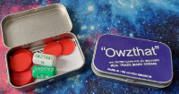
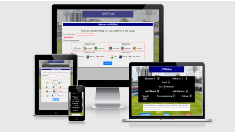
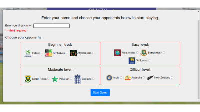

# OWZthat
## Portfolio-project-2-Javascript-Essentials

### overview
Owzthat was a game I played when I was a child in the 1970's. It was based on the game of cricket and involved the rolling of two six sided dice. I thought it would be great if this game could be reproduced as an online version so users could experience the entertainment I had as a child with a few extra features. The user or player plays against the computer, which generates a target score based on one of four levels chosen by input from the player. The player has to beat the target set by the computer. 

Owzthat demonstrates Javascript in its use of arrays, event listeners random number generators, conditional statements, manipulation of the DOM and functions to replicate the gameplay. 

### responsiveness screenshot

Screenshot of Owzthat displayed on Am I Responsive website.

### features

#### Opening game start dialogue box
Upon opening Owzthat a game start dialogue box is immediately displayed to the player. The gameplay area is displayed greyed out in the background. This is so the player can enter their name and choose an opponent and difficulty level. 

On submitting the dialogue box form, it is validated to ensure the player has entered a name and selected a team to play against. If there is data missing a further dialogue box is displayed to the player informing them the fields must be completed before continuing.

Once the form passes validation and is submitted by the player, a target score is generated and the main game play screen is revealed.

### existing features
#### game play page and rules page
#### heading
#### nav
#### scoreboard
#### dialogue/commentary area
#### buttons
#### rules

### features left to implement

### Testing
browsers
HTML
CSS
Javascript
include metrics
![lighthouse report screenshot]

### unfixed bugs

### Deployment

### Credits
#### content
W3Schools
bootstrap
font-awesome
#### media
shutterstock
icons

